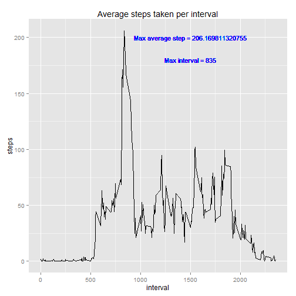
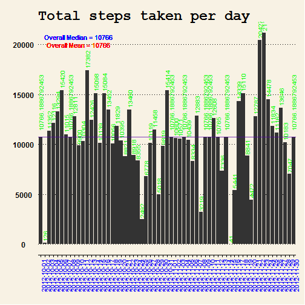

# PeerAssessment 1 for Reproducible Research

The data used in this exercise is the Activity monitoring data. The data is saved in the local disk and then processed in R

## Loading and processing the data

The data saved in local disk is loaded and read into the dataframe acivity.df
Also the required packages are loaded

```r
library("ggplot2",lib.loc="D:/ReadPlease/Rpackage/")
library("ggthemes",lib.loc="D:/ReadPlease/Rpackage/")
library("scales",lib.loc="D:/ReadPlease/Rpackage/")
library("plyr",lib.loc="D:/ReadPlease/Rpackage/")

setwd("D:/ReadPlease/CourseraDataScience/Reproducibleresearch/RRPA1")
activity.df <- read.csv("D:/ReadPlease/CourseraDataScience/Reproducibleresearch/activity.csv")
```

## Mean total number of steps taken per day

The number of steps taken in a day is measured in intervals of 5. These need to be aggregated for each day and stored in dataframe activity.sum
Below code aggregates the steps taken and plot a graph. The Mean and Median is also plotted as a horizontal line 

```r
activity.sum <- aggregate(steps ~ date, data=activity.df, FUN=sum)

ggplot(activity.sum, aes(x=date, y=steps)) +
    theme_wsj() +
    theme(axis.text.x  = element_text(size=10,
                                      angle=90,
                                      colour="blue",
                                      vjust=1,
                                      hjust=1)) +
    geom_text(aes(x = date, 
                  y = steps, 
                  label = steps, 
                  angle  = 90, 
                  size = 5, 
                  hjust = -0.1), 
              color = "green", 
              show_guide  = F) +
    geom_bar(stat="identity") +
    ggtitle("Total steps taken per day") +
    geom_hline(aes(yintercept = mean(steps, na.rm = TRUE)),
    color = "red", size = .5, alpha = .50) +
    geom_hline(aes(yintercept = median(steps, na.rm = TRUE)),
    color = "blue", size = .5, alpha = .50) +
    geom_text(aes(label = paste("Overall Mean =", round(mean(steps, na.rm = TRUE),0) ),
    x = 10, y = 20000), color = "red", size = 4) +
    geom_text(aes(label = paste("Overall Median =", median(steps, na.rm = TRUE) ),
    x = 10, y = 20800), color = "blue", size = 4) 
```

 

##  Average daily activity pattern

The number of steps taken in a day is measured in intervals of 5. The Average steps taken during each interval (averaged across all days)need to be calculated. Also the interval which has the highest average steps taken to be calculated and added to the plot


```r
activity.sum <- aggregate(steps ~ interval, data=activity.df, FUN=mean)

max.int.var <- activity.sum[which.max(activity.sum$steps),]

ggplot(activity.sum, aes(x=interval, y=steps)) +
    geom_line() +
    ggtitle("Average steps taken per interval") +
    geom_text(aes(label = paste("Max average step =", max(steps, na.rm = TRUE) ),
    x = 1500, y = 200), color = "blue", size = 4) +
    geom_text(aes(label = paste("Max interval =", max.int.var$interval ),
    x = 1500, y = 180), color = "blue", size = 4) 
```

 

## Imputing missing values

Calculate the total number of missing values in the dataset 

```r
totalna <- sum(is.na(activity.df$steps))
```

Total number of missing values in the dataset is 2304.

Since we have 2304 missing values in the dataset, we need to fill in the missing values. We need to calculate the mean value below


```r
totalmean <- mean(activity.df$steps, na.rm=TRUE)
```

The mean value is 37.3825996. We can fill in the mean value of 37.3825996 to the missing values. This will Create a new dataset that is equal to the original dataset but with the missing data filled in

```r
activity.df$steps[is.na(activity.df$steps)] <- totalmean
```

The number of steps taken in a day is measured in intervals of 5. These need to be aggregated for each day and stored in dataframe activity.sum
Below code aggregates the steps taken and plot a graph. The Mean and Median is also plotted as a horizontal line

```r
activity.sum <- aggregate(steps ~ date, data=activity.df, FUN=sum)

ggplot(activity.sum, aes(x=date, y=steps)) +
    theme_wsj() +
    theme(axis.text.x  = element_text(size=10,
                                      angle=90,
                                      colour="blue",
                                      vjust=1,
                                      hjust=1)) +
    geom_text(aes(x = date, 
                  y = steps, 
                  label = steps, 
                  angle  = 90, 
                  size = 5, 
                  hjust = -0.1), 
              color = "green", 
              show_guide  = F) +
    geom_bar(stat="identity") +
    ggtitle("Total steps taken per day") +
    geom_hline(aes(yintercept = mean(steps, na.rm = TRUE)),
    color = "red", size = .5, alpha = .50) +
    geom_hline(aes(yintercept = median(steps, na.rm = TRUE)),
    color = "blue", size = .5, alpha = .50) +
    geom_text(aes(label = paste("Overall Mean =", round(mean(steps, na.rm = TRUE),0) ),
    x = 10, y = 20000), color = "red", size = 4) +
    geom_text(aes(label = paste("Overall Median =", round(median(steps, na.rm = TRUE),0) ),
    x = 10, y = 20800), color = "blue", size = 4) 
```

 

We can see that the new plot has values for the dates which were missing in plot1
Also the mean and median has not changed because we introduced the mean value to the missing values. 

## Differences in activity patterns between weekdays and weekends 

Introduce a new column in the dataframe which has a factor to denote the row as weekday or weekend

```r
weekdays1 <- c('Monday', 'Tuesday', 'Wednesday', 'Thursday', 'Friday')

activity.df$day <- factor((weekdays(as.Date(activity.df$date)) %in% weekdays1), levels=c(FALSE, TRUE), labels=c('weekend', 'weekday'))
```

Aggregagte the for each factor(weekday or weekend) and interval value and plot the values for weekday and weekend

```r
activity.sum <- ddply(activity.df, .(day, interval), summarise, average = mean(steps,na.rm=TRUE))

activity.sum$int <- as.POSIXct(strptime(sprintf("%04d", activity.sum$interval), "%H%M")) 

ggplot(activity.sum, aes(x=int, y=average, group=day, color=day)) +
    facet_grid(day~.) +
    geom_line() +
    theme_economist() +
    ggtitle("Average steps taken in weekdays and weekends") +
    theme(axis.text.x=element_text(angle=270, hjust=1,vjust=0.5, size = 10)) +
    scale_x_datetime(breaks = date_breaks("30 mins"),
                     labels = date_format("%H:%M")) + 
    ylab("Average steps") + 
    xlab("30 minute Time Intervals in a day")
```

 
